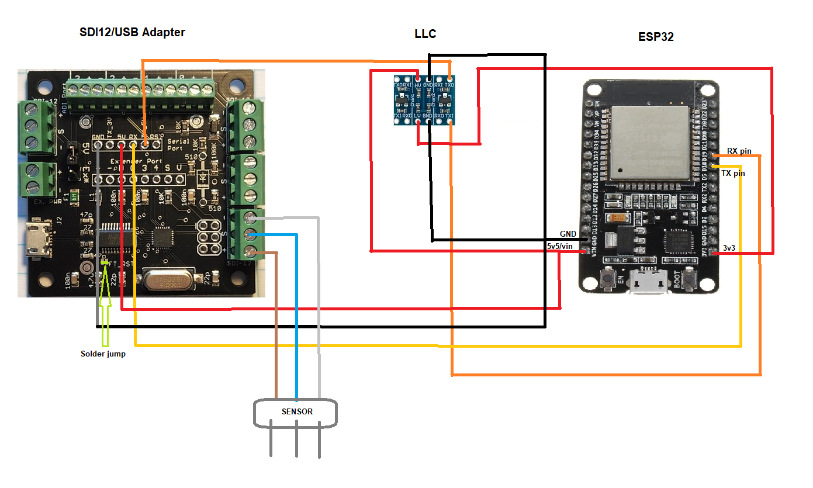

ESP32/ESPHome SDI12 Sensor Hub

### BoM:
- [Dr. Liu's SDI12 adapter](https://liudr.square.site/product/sdi-12-microusb-adapter/50?cs=true&cst=custom)
- Bidirectional I2C Logic Level Converter (LLC) 5v-3.3v
- ESP32 or similar
- SDI12 sensor, like Metergroup Teros12, Acclima TDR-315N, etc

### Build Scheme:

### Install and configure
1. Open ESPHome dashboard and [follow the steps to connect a new device](https://esphome.io/guides/getting_started_hassio.html#installing-esphome-dashboard).
2. Access your Home Assistant config files and upload the file [uart_read_line_sensor.h](uart_read_line_sensor.h) to `config/esphome`.
3. Update the device with [sensor_reader.yaml](sensor_reader.yaml).