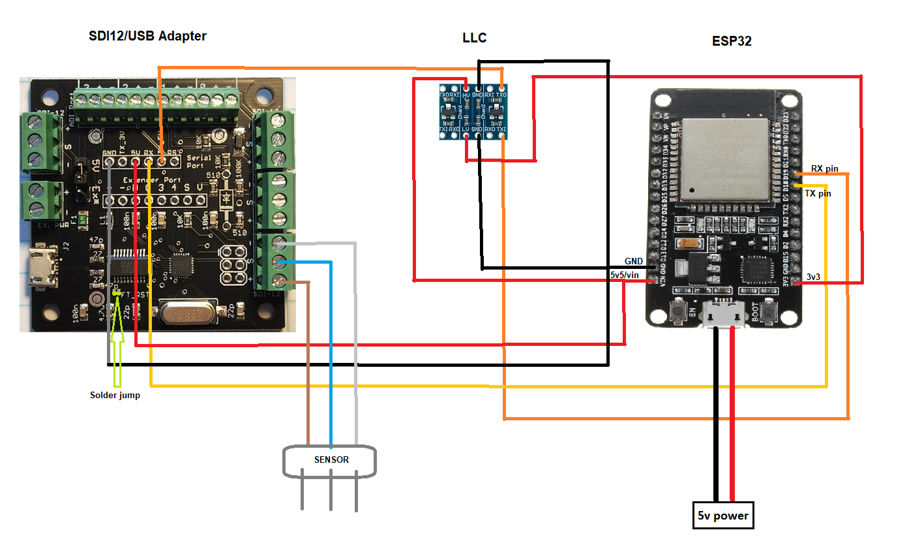
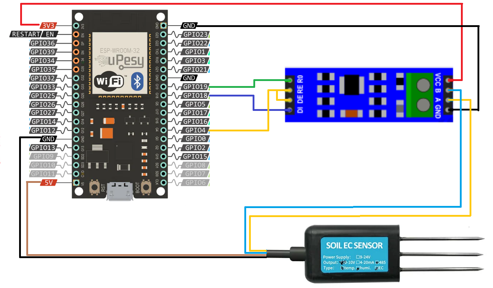
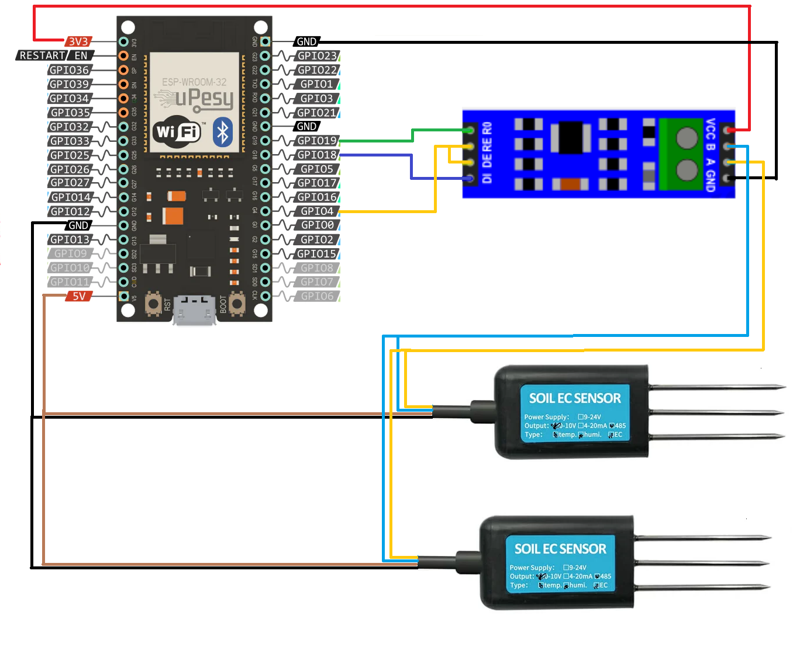

ESP32/ESPHome SDI12/Modbus Sensor Hub

## SDI12

### BoM - SDI12:
- [Dr. Liu's SDI12 adapter](https://liudr.square.site/product/sdi-12-microusb-adapter/50?cs=true&cst=custom)
- ESP32 or similar
- Bidirectional I2C Logic Level Converter (LLC) 5v-3.3v
- SDI12 sensor, like Metergroup Teros12, Acclima TDR-315N, etc

### Build Scheme:

### Install and configure
1. Open ESPHome dashboard and [follow the steps to connect a new device](https://esphome.io/guides/getting_started_hassio.html#installing-esphome-dashboard).
2. Access your Home Assistant config files and upload the file [sdi12/uart_read_line_sensor.h](sdi12/uart_read_line_sensor.h) to `config/esphome`.
3. Update the device with [sdi12/sensor_reader.yaml](sdi12/sensor_reader.yaml).

## Modbus/RS485

### BoM - Modbus/RS485:
- ESP32 or similar
- [TTL to RS485 (MAX485) bidirectional module for Arduino](https://pt.aliexpress.com/item/32848382513.html)
- RS485 sensor, like [ComWinTop climate sensors](https://pt.aliexpress.com/store/910369336)

### Build Scheme

#### Single sensor:

#### Multiple sensors:

### Install and configure
1. Open ESPHome dashboard and [follow the steps to connect a new device](https://esphome.io/guides/getting_started_hassio.html#installing-esphome-dashboard).
2. Update the device with:
   1. For single sensors: [rs485/modbus-sensor-reader.yaml](rs485/modbus-sensor-reader.yaml).
   1. For multiple sensors: [rs485/modbus-sensor-reader-multi.yaml](rs485/modbus-sensor-reader-multi.yaml).
  
## Tools
[Terminal BPP](https://sites.google.com/site/terminalbpp/) - COM port development tool, to conect and interact with SDI-12 adapter over USB. With it you can send commands do read and write to SDI-12 sensors.
